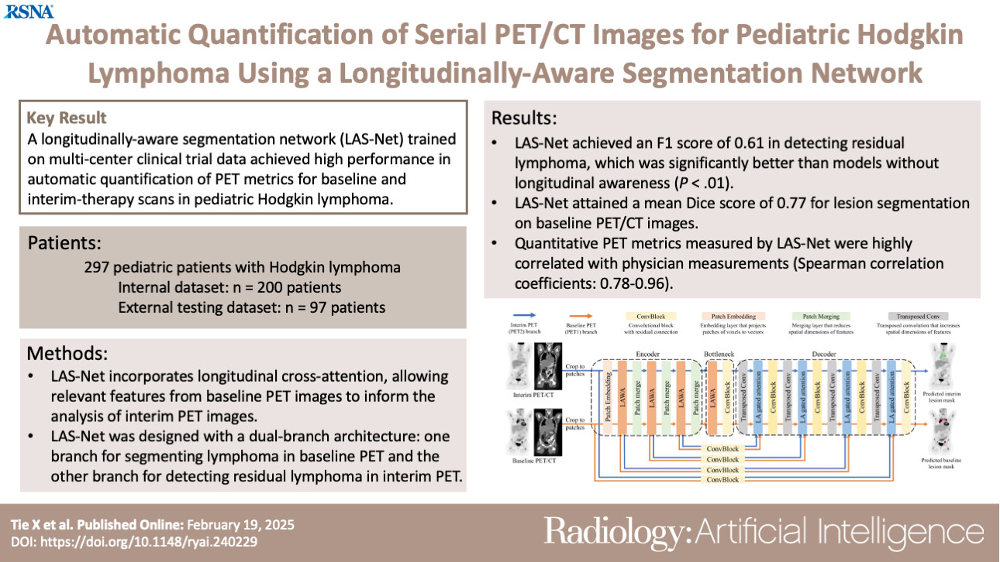

# LAS-Net Lymphoma PET/CT Segmentation Docker

This Docker image runs automated Hodgkin lymphoma segmentation on baseline & interim PET/CT scans using our proposed Longitudinally-Aware Segmentation Network (LAS-Net). The paper was published in Radiology: Aritificial Intelligence (2025)
<p align="center">
  
</p>

Docker image:

```bash
xtie97/lasnet-lymphoma
```

The container supports two prediction settings:

1. **Baseline lymphoma segmentation**
   - Input: baseline PET/CT only
   - Output: baseline lymphoma lesion mask

2. **Interim / residual lymphoma segmentation**
   - Input: baseline PET/CT and interim PET/CT
   - Output: interim residual lesion mask

The container also supports two types of checkpoints:

- `rigid`: models trained using rigidly aligned longitudinal PET/CT inputs
- `deform`: models trained using deformably aligned longitudinal PET/CT inputs

---

## 1. Pull the Docker image

```bash
docker pull xtie97/lasnet-lymphoma:latest
```

If GPU inference is available, run with:

```bash
--gpus all
```

If GPU inference is not available, remove `--gpus all`. The model will run on CPU, but inference will be slower.

---

## 2. Input options

The container accepts either NIfTI input or DICOM input.

### Option A: NIfTI input

Prepare a folder containing the PET/CT NIfTI files.

For **baseline prediction**, the folder should contain:

```text
input_nifti/
  PET1.nii.gz
  CT1.nii.gz
```

For **interim / residual prediction**, the folder should contain:

```text
input_nifti/
  PET1.nii.gz
  CT1.nii.gz
  PET2.nii.gz
  CT2.nii.gz
```

where:

- `PET1.nii.gz`: baseline PET image, expected to be in SUV units
- `CT1.nii.gz`: baseline CT image
- `PET2.nii.gz`: interim PET image, expected to be in SUV units
- `CT2.nii.gz`: interim CT image

### Option B: DICOM input

The container can also convert PET/CT DICOM series to NIfTI internally. In this mode, provide paths to the DICOM folders using:

```bash
--use-dicom-input
--input-PET1 <baseline PET DICOM folder>
--input-CT1  <baseline CT DICOM folder>
--input-PET2 <interim PET DICOM folder>
--input-CT2  <interim CT DICOM folder>
```

For baseline-only prediction, `--input-PET2` and `--input-CT2` are not required.

When DICOM input is used, the container will also generate an RTSTRUCT file in the output folder.

---

## 3. Output files

For baseline prediction, the output folder will contain:

```text
output_baseline.nii.gz
```

If DICOM input is used, it will also contain:

```text
output_baseline.dcm
```

For interim / residual prediction, the output folder will contain:

```text
output_interim.nii.gz
```

If DICOM input is used, it will also contain:

```text
output_interim.dcm
```

---

## 4. Important Docker path rule

Use **absolute host paths** for volume mounts. For example, use:

```bash
-v /absolute/path/to/input:/input
```

because Docker may interpret `test/input` as a named Docker volume instead of a host folder.

---

## 5. NIfTI examples

Replace `/path/to/input_nifti` and `/path/to/output` with absolute paths on your machine.

### 5.1 Baseline lymphoma segmentation

```bash
docker run --rm --gpus all \
  -v /path/to/input_nifti:/input \
  -v /path/to/output:/output \
  xtie97/lasnet-lymphoma:latest \
  --input-dir /input \
  --output-dir /output \
  --model-type rigid
```

### 5.2 Interim / residual lesion segmentation with rigid models

```bash
docker run --rm --gpus all \
  -v /path/to/input_nifti:/input \
  -v /path/to/output:/output \
  xtie97/lasnet-lymphoma:latest \
  --input-dir /input \
  --output-dir /output \
  --generate-interim-lesion-mask \
  --model-type rigid
```

### 5.3 Interim / residual lesion segmentation with deformable models

```bash
docker run --rm --gpus all \
  -v /path/to/input_nifti:/input \
  -v /path/to/output:/output \
  xtie97/lasnet-lymphoma:latest \
  --input-dir /input \
  --output-dir /output \
  --generate-interim-lesion-mask \
  --model-type deform
```

---

## 6. DICOM examples

For DICOM input, mount the DICOM case folder as read-only and mount a separate writable output folder. The container will write temporary NIfTI files under `/output/nifti` and final results under `/output`.

Example host folder:

```text
case_dicom/
  baseline_pet/
  baseline_ct/
  interim_pet/
  interim_ct/
```

### 6.1 Baseline lymphoma segmentation from DICOM

```bash
docker run --rm --gpus all \
  -v /path/to/case_dicom:/input \
  -v /path/to/output:/output \
  xtie97/lasnet-lymphoma:latest \
  --use-dicom-input \
  --input-dir /input/nifti \
  --output-dir /output \
  --input-PET1 /input/baseline_pet \
  --input-CT1 /input/baseline_ct \
  --model-type rigid
```
 
### 6.2 Interim / residual lesion segmentation from DICOM

```bash
docker run --rm --gpus all \
  -v /path/to/case_dicom:/input \
  -v /path/to/output:/output \
  xtie97/lasnet-lymphoma:latest \
  --use-dicom-input \
  --input-dir /input/nifti \
  --output-dir /output \
  --input-PET1 /input/baseline_pet \
  --input-CT1 /input/baseline_ct \
  --input-PET2 /input/interim_pet \
  --input-CT2 /input/interim_ct \
  --generate-interim-lesion-mask \
  --model-type rigid
```

To use deformable models instead, change:

```bash
--model-type rigid
```

to:

```bash
--model-type deform
```

---

## 7. Arguments

| Argument | Required? | Description |
|---|---:|---|
| `--input-dir` | Yes for NIfTI input | Folder containing `PET1.nii.gz`, `CT1.nii.gz`, and optionally `PET2.nii.gz`, `CT2.nii.gz`. |
| `--output-dir` | Yes | Folder where output masks and optional RTSTRUCT files are written. |
| `--model-type rigid` | Optional | Use the rigid model ensemble. This is the default. |
| `--model-type deform` | Optional | Use the deformable model ensemble. |
| `--generate-interim-lesion-mask` | Optional | Generate interim/residual lesion mask. If omitted, the container generates the baseline lesion mask. |
| `--use-dicom-input` | Optional | Use DICOM input and internally convert PET/CT to NIfTI. |
| `--input-PET1` | Required with DICOM input | Baseline PET DICOM folder. |
| `--input-CT1` | Required with DICOM input | Baseline CT DICOM folder. |
| `--input-PET2` | Required for interim DICOM prediction | Interim PET DICOM folder. |
| `--input-CT2` | Required for interim DICOM prediction | Interim CT DICOM folder. |

---

## 8. Notes for interpretation

- Baseline PET and interim PET images are expected to be in SUV units when NIfTI input is used.
- When NIfTI input is used, baseline and interim PET images are expected to be provided in SUV units.
- When DICOM input is used, the container converts PET images to SUV internally using DICOM metadata. However, the current implementation does not support Philips PET/CT scans because the PET unit is stored as `CNTS` rather than `BQML`. It also cannot perform SUV conversion if required metadata are missing, including patient weight, radiotracer dose information, injection time, or scan time.
- If automatic SUV conversion fails for these reasons, we recommend converting or scaling the PET image before running the container. One practical solution is liver-based scaling, using the average liver SUV calibrated in our cohort as a reference value of 1.73.
- The container uses an ensemble of five models for each model family.
- The expected checkpoint names inside the container are:

```text
lasnet_rigid_f1.pt
lasnet_rigid_f2.pt
lasnet_rigid_f3.pt
lasnet_rigid_f4.pt
lasnet_rigid_f5.pt

lasnet_deform_f1.pt
lasnet_deform_f2.pt
lasnet_deform_f3.pt
lasnet_deform_f4.pt
lasnet_deform_f5.pt
```

---

## 9. Troubleshooting

### Docker says the volume name is invalid

Use absolute host paths:

```bash
-v $(pwd)/input:/input
```

or:

```bash
-v /full/path/to/input:/input
```
 
### RTSTRUCT is not generated

RTSTRUCT generation is only enabled when DICOM input is used with:

```bash
--use-dicom-input
```

If NIfTI input is used, the container generates only the NIfTI segmentation mask.

---
 
